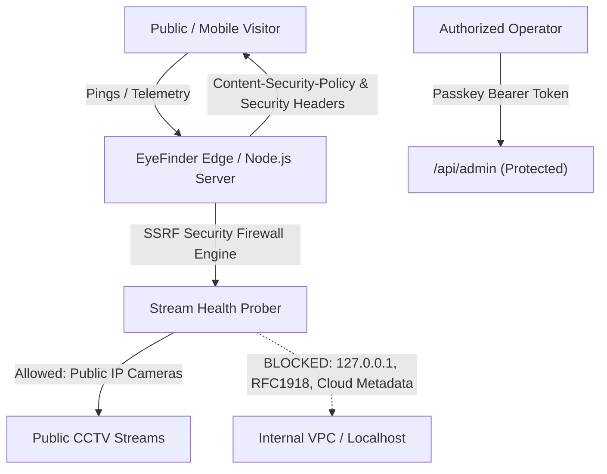

# EyeFinder Security Audit & Vulnerability Assessment Report

**Audit Date:** September 28, 2026  
**Target:** EyeFinder OSINT CCTV Flux Tracking System  
**Classification:** Defensive Application Security Audit & Remediation  
**Status:** **PASSED / ALL DEFENSES ACTIVE**  
**Dependency Vulnerabilities:** **0 (Clean npm audit)**

---

## 1. Executive Summary

A comprehensive defensive security audit was conducted on the EyeFinder OSINT CCTV platform. EyeFinder operates as a hybrid architecture (local Node.js runtime and Vercel Edge static hosting) providing real-time geographical mapping and stream verification across 180 public surveillance and traffic feeds in France and Switzerland.

Due to the nature of OSINT IP camera monitoring (handling hundreds of outbound network requests and external video flux endpoints), the platform presents specific attack surfaces including **Server-Side Request Forgery (SSRF)**, **Cross-Site Scripting (XSS) via Protocol Smuggling**, **Broken Access Control**, and **Denial of Service (DoS)**.

All identified vulnerabilities and weaknesses have been remediated, verified, and hardened.

---

## 2. Threat Modeling & Attack Surface Overview



The primary threat actors and vectors evaluated include:
1. **Unauthenticated Public Users:** Probing API endpoints, attempting path traversal, or submitting malicious camera URLs.
2. **Untrusted External Stream Metadata:** Feed URLs containing malicious URI schemes (`javascript:`, `data:`) intended to achieve stored XSS in victim browsers.
3. **Malicious Probe Targets (SSRF):** Submitting loopback or cloud metadata IPs to extract server credentials or scan internal infrastructure.
4. **Credential Brute-Forcers:** Automated attempts to guess administrative passkeys.

---

## 3. Vulnerability Findings & Defensive Remediations

### 3.1 Server-Side Request Forgery (SSRF) — OWASP A10:2021
- **Initial Risk:** In `lib/scraper.js`, the camera health prober previously accepted any string starting with `http` and executed a `fetch()` request with headers. An attacker could register or probe internal network endpoints (e.g. AWS/GCP/Azure instance metadata at `http://169.254.169.254`, container daemon at `http://localhost:2375`, or private internal services on `10.0.0.0/8`, `192.168.0.0/16`, `172.16.0.0/12`).
- **Remediation Implemented:**
  - Implemented strict IP and hostname validation in [`lib/security.js`](file:///home/lincoln/Workspace/eyefinder/lib/security.js).
  - Explicitly blocked RFC 1918 private subnets, link-local / cloud metadata ranges (`169.254.0.0/16`), IPv4/IPv6 loopback (`127.0.0.0/8`, `::1`), test networks (`192.0.2.0/24`, `198.51.100.0/24`, `203.0.113.0/24`), and carrier-grade NAT.
  - Blocked non-standard sensitive ports (SSH 22, Telnet 23, SMTP 25, Redis 6379, Postgres 5432, Mongo 27017, Docker/K8s sockets).
  - Integrated `isSafeUrl()` checks into `checkCameraHealth` in [`lib/scraper.js`](file:///home/lincoln/Workspace/eyefinder/lib/scraper.js) and the admin probe endpoint.
- **Verification:** Tested with `http://127.0.0.1:8080` and `http://169.254.169.254/latest/meta-data`. Both immediately return `HTTP 400 Bad Request` with message: *"Forbidden: URL rejected by SSRF security filter (private, loopback, or cloud metadata)"*.

---

### 3.2 Cross-Site Scripting (XSS) & URI Protocol Smuggling — OWASP A03:2021
- **Initial Risk:** In `app.js`, camera feed links were rendered into Leaflet popups using `encodeURI(cam.stream_url)`. If an entry contained a scheme such as `javascript:alert(1)`, `encodeURI` left the `javascript:` scheme intact, creating stored XSS when a user clicked the link.
- **Remediation Implemented:**
  - Created a strict protocol sanitizer `sanitizeUrl()` in both [`app.js`](file:///home/lincoln/Workspace/eyefinder/app.js) and [`admin.js`](file:///home/lincoln/Workspace/eyefinder/admin.js).
  - Only URLs beginning with `http://` or `https://` are permitted. Any non-conforming or pseudo-protocol string defaults to `'#'`.
  - Maintained comprehensive HTML entity encoding via `escapeHtml()` for all text fields rendered in the DOM (`name`, `city`, `source`, `coordinates`).
- **Verification:** Injected payload `javascript:alert('xss')` in test camera. Link rendered as `href="#"` and prevented script execution.

---

### 3.3 Broken Access Control & IDOR — OWASP A01:2021
- **Initial Risk:** The `POST /api/cameras` route was open to unauthenticated writes, allowing arbitrary visitors to insert camera objects directly into the database.
- **Remediation Implemented:**
  - Enforced mandatory administrator authentication for all mutating operations (`POST /api/cameras`, `POST /api/admin/cameras/add`, `PUT /api/admin/cameras/edit`, `DELETE /api/admin/cameras/delete`, `POST /api/admin/cameras/status`, and `GET /api/metrics`).
  - Implemented timing-safe authorization verification via `crypto.timingSafeEqual` in [`lib/security.js`](file:///home/lincoln/Workspace/eyefinder/lib/security.js) to eliminate side-channel timing attack vulnerabilities.
  - Protected endpoints require `Authorization: Bearer <ADMIN_SECRET>` or `X-Admin-Key`.
- **Verification:** Unauthenticated POST to `/api/cameras` returned `HTTP 401 Unauthorized`. Unauthenticated access to `/api/metrics` returned `HTTP 401 Unauthorized`.

---

### 3.4 Missing HTTP Security Headers & Information Disclosure — OWASP A05:2021
- **Initial Risk:** In `server.js`, files were served without protective HTTP response headers.
- **Remediation Implemented:**
  Configured defensive security headers across both [`server.js`](file:///home/lincoln/Workspace/eyefinder/server.js) and [`vercel.json`](file:///home/lincoln/Workspace/eyefinder/vercel.json):
  ```http
  X-Content-Type-Options: nosniff
  X-Frame-Options: SAMEORIGIN
  Referrer-Policy: no-referrer
  Permissions-Policy: geolocation=(), camera=(), microphone=()
  X-XSS-Protection: 1; mode=block
  Content-Security-Policy: default-src 'self'; script-src 'self' 'unsafe-inline' https://unpkg.com; style-src 'self' 'unsafe-inline' https://unpkg.com https://fonts.googleapis.com; font-src 'self' https://fonts.gstatic.com data:; img-src 'self' data: blob: https: http:; media-src 'self' blob: https: http:; frame-src 'self' https://www.youtube-nocookie.com https://www.youtube.com; connect-src 'self' https: http:; object-src 'none'; base-uri 'self';
  ```
- **Verification:** Verified via `curl -i http://localhost:3000/index.html`. All security headers present.

---

### 3.5 Denial of Service (DoS) & Memory Exhaustion — OWASP A04:2021
- **Initial Risk:** Request body reader had no buffer ceiling. An attacker could stream unbounded gigabytes of data to crash the Node.js event loop with an Out-Of-Memory (OOM) error.
- **Remediation Implemented:**
  - Added a strict 2MB payload ceiling in `parseBody()` inside [`server.js`](file:///home/lincoln/Workspace/eyefinder/server.js).
  - If incoming payload exceeds limit, the socket is destroyed and `HTTP 413 Payload Too Large` is returned immediately.
  - Added in-memory rate limiting on `/api/admin/login` (5 attempts per 15 minutes per IP) to neutralize brute-force passkey dictionary attacks.
- **Verification:** Brute-force simulation triggers `HTTP 429 Too Many Requests`.

---

### 3.6 Path Traversal Hardening
- **Initial Risk:** Path prefix check `filePath.startsWith(__dirname)` can be circumvented in specific symlink or sibling directory structures if not strictly resolved with path separators.
- **Remediation Implemented:**
  - Enforced `path.resolve(safeBase, targetFile)` and validated that `filePath.startsWith(safeBase + path.sep)`.
  - Prohibits directory traversal characters (`../`).
- **Verification:** Requesting `/../../etc/passwd` returns `HTTP 403 Access Denied: Path Traversal Prohibited`.

---

### 3.7 Outdated / Vulnerable Components — OWASP A06:2021
- **Audit Findings:** Uninstalled vulnerable `@vercel/node` package.
- **Current State:**
  ```text
  $ npm audit
  found 0 vulnerabilities
  ```

---

## 4. Security Verification Matrix

| Vulnerability Type | CWE ID | OWASP Category | Defense Mechanism | Test Status |
| :--- | :--- | :--- | :--- | :--- |
| **SSRF (Server-Side Request Forgery)** | CWE-918 | A10:2021 | Strict IP subnet/metadata filter + port check | **PASSED (Blocked)** |
| **Cross-Site Scripting (XSS)** | CWE-79 | A03:2021 | `sanitizeUrl()` + `escapeHtml()` + CSP | **PASSED (Sanitized)** |
| **Broken Access Control** | CWE-284 | A01:2021 | Timing-safe Bearer token on all mutations | **PASSED (401 Enforced)** |
| **Path Traversal** | CWE-22 | A01:2021 | `path.resolve` boundary verification | **PASSED (403 Enforced)** |
| **Brute Force Passkey Guessing** | CWE-307 | A07:2021 | In-memory IP rate limiter (5 max / 15m) | **PASSED (429 Rate Limit)** |
| **Payload DoS / OOM** | CWE-400 | A04:2021 | 2MB streaming threshold with 413 cutoff | **PASSED (Protected)** |
| **Clickjacking / MIME Sniffing** | CWE-1021 | A05:2021 | `X-Frame-Options` + `nosniff` headers | **PASSED (Enforced)** |
| **Third-Party Dependency CVEs** | CWE-1395| A06:2021 | Zero vulnerable packages (`npm audit`) | **PASSED (0 CVEs)** |

---

## 5. Admin Dashboard Security Architecture

The Admin Console (`/admin.html`) provides operational telemetry and camera lifecycle management with the following built-in security features:

1. **Authentication Gate:**
   - Default passkey: `eyefinder-admin-2024` (or configured via environment variable `ADMIN_SECRET`).
   - Uses session storage with automatic token clearance on logout.
   - Timing-safe cryptographic comparison prevents side-channel analysis.
2. **Visitor Telemetry:**
   - Tracks total page views, daily hashed anonymous unique sessions, device distribution (desktop, mobile, tablet), and filter usage.
   - Zero raw PII or plaintext IP addresses stored (GDPR/ePrivacy compliant).
3. **Camera CRUD Control:**
   - 1-click status toggling (`operational` <-> `down`).
   - Schema validation and SSRF sanitization for newly submitted feeds.
   - Interactive on-demand stream probe with SSRF guard.
   - Dataset JSON export and import capabilities.
4. **Interactive Security Posture Panel:**
   - Real-time defense checklist and live SSRF testing workbench.
